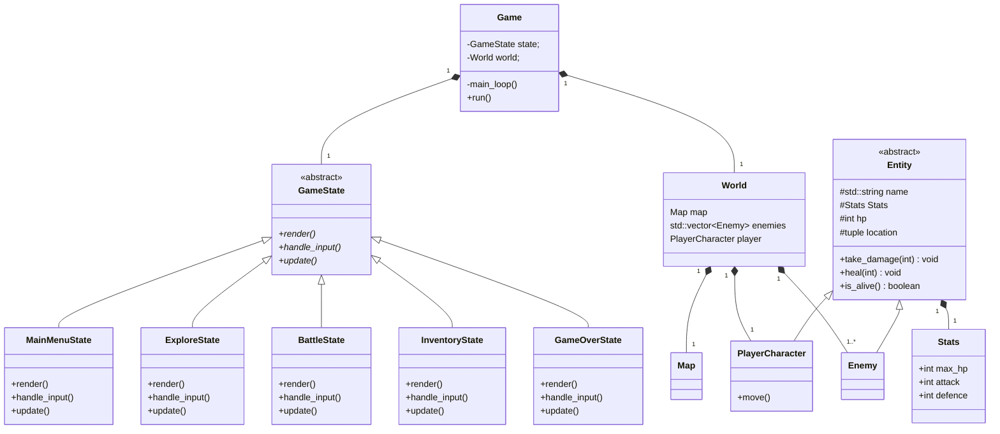

# PA4 - JRPG

## Mermaid diagram of the class structure

```mermaid
classDiagram
class Game{
    -GameState state;
    -World world;
    -main_loop()
    +run()
}

Game "1" *-- "1" GameState
Game "1" *-- "1" World

class GameState{
    <<abstract>>
    +render()*
    +handle_input()*
    +update()*
}

GameState <|-- MainMenuState
GameState <|-- ExploreState
GameState <|-- BattleState
GameState <|-- InventoryState
GameState <|-- GameOverState

class MainMenuState {
    +render()
    +handle_input()
    +update()
}

class ExploreState {
    +render()
    +handle_input()
    +update()
}

class BattleState {
    +render()
    +handle_input()
    +update()
}

class InventoryState {
    +render()
    +handle_input()
    +update()
}

class GameOverState {
    +render()
    +handle_input()
    +update()
}

class World{
    Map map
    std::vector~Enemy~ enemies
    PlayerCharacter player
}

World "1" *-- "1" Map
World "1" *-- "1" PlayerCharacter
World "1" *-- "1..*" Enemy

class Entity{
    <<abstract>>
    #std::string name
    #Stats Stats
    #int hp
    #tuple location
    +take_damage(int) void
    +heal(int) void
    +is_alive() boolean
}

Entity "1" *-- "1" Stats
Entity <|-- PlayerCharacter
Entity <|-- Enemy

class Stats{
    +int max_hp
    +int attack
    +int defence
}

class PlayerCharacter{
    +move()
}

class Enemy{}
```